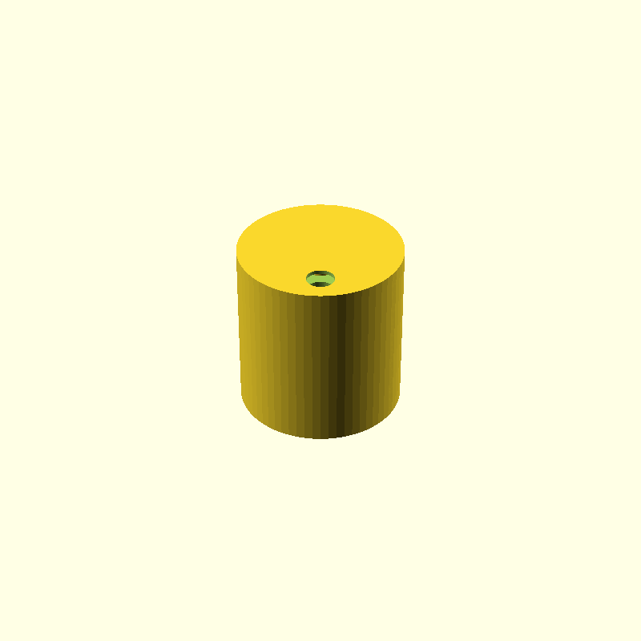

# Silicon Rubber Mold

Parametric **silicon rubber mold** designer in OpenSCAD (v4).

The tooling is **three pieces**:

1. **Two clamshell halves** — outer shape of the spool (parting plane XZ, open along ±Y)  
2. **Loose core pin** — forms the axial hole; **pulled out along Z** before the halves open  

The export animation shows the halves opening and the core extracting together.

### Why this layout?

| Bad design | Problem |
|------------|---------|
| 4 radial quarters | Disks sit in fixed-height U-grooves → opening scrapes/tears the part |
| Core molded into the halves | Fixed axle through both end caps → hollow shaft is cast *onto* that axle and **rips when the halves open** |
| **2 halves + loose core** (this design) | Core withdraws along the axis; halves then open with no undercut |

### Demolding sequence

1. **Pull the core pin** out along the axis (use the end tabs)  
2. **Open the two halves** along ±Y  
3. Remove the cast; trim sprue / vent runners



---

## Requirements

Install these tools and put them on your `PATH`:

| Tool | Used for | Check |
|------|----------|--------|
| [OpenSCAD](https://openscad.org/) (≥ 2021.01) | STL, PNG, animation frames | `openscad --version` |
| [ImageMagick](https://imagemagick.org/) (`convert`) | Assemble frames into a GIF | `convert --version` |

```bash
cd rubberMold
chmod +x export.sh animate.sh   # once
```

---

## Quick start

```bash
cd rubberMold

./export.sh stl          # mesh → build/stl/rubberMold.stl
./export.sh png          # fully open preview → build/anim/rubberMold.png
./export.sh anim         # open → close GIF → build/anim/rubberMold.gif
./export.sh all          # stl + png + anim (default if you omit a target)
```

---

## Using `export.sh`

```bash
./export.sh --help
./export.sh [options] [stl|png|anim|all]
```

The script always runs from its own directory, so this also works:

```bash
/path/to/rubberMold/export.sh anim
```

### Targets

| Target | What it does | Output |
|--------|----------------|--------|
| `stl` | Printable STLs: halves, core, closed assembly | `build/stl/rubberMold_halves.stl`, `…_core.stl`, `…_assembly.stl` |
| `png` | Preview at full open (halves apart, core extracted) | `build/anim/rubberMold.png` |
| `anim` | Open/extract → close/reseat cycle + GIF | `build/anim/rubberMold_XX.png` + `rubberMold.gif` |
| `all` | `stl` + `png` + `anim` | all of the above |

### Options

| Flag | Env var | Default | Meaning |
|------|---------|---------|---------|
| `-r`, `--radius N` | `WHEEL_RADIUS` | `40` | `wheelRadius` in the model |
| `-f`, `--fn N` | `FN` | `64` | Cylinder segments (higher = smoother & slower) |
| `-s`, `--sep N` | `MAX_SEP` | `25` | Peak half separation when fully open |
| `-n`, `--frames N` | `FRAMES` | `40` | Frames for one full open+close cycle (min 3) |
| `-d`, `--delay CS` | `DELAY_CS` | `8` | GIF delay in centiseconds (`8` ≈ 0.08 s/frame) |
| `-h`, `--help` | — | — | Print usage |

### Examples

```bash
# Fast checks
./export.sh stl
./export.sh png

# Default open → close animation
./export.sh anim

# Wider open, fewer frames (quick test)
./export.sh -n 12 -s 25 anim

# Smoother mesh for printing
./export.sh --fn 128 stl

# Custom size, full export
./export.sh -r 30 -n 24 all

# Environment variables instead of flags
WHEEL_RADIUS=25 FN=96 FRAMES=24 MAX_SEP=22 ./export.sh anim
```

### Output layout

```
rubberMold/
├── export.sh
├── animate.sh              # thin wrapper → ./export.sh anim
├── rubberMold.scad
├── rubberMold.json         # OpenSCAD Customizer parameter sets
├── toolchain               # manual CLI recipes
└── build/
    ├── stl/
    │   └── rubberMold.stl
    └── anim/
        ├── rubberMold.png           # png target (fully open)
        ├── rubberMold_01.png        # anim frames (zero-padded)
        ├── rubberMold_02.png
        ├── …
        └── rubberMold.gif           # open → close, loops
```

---

## Animation (open → close)

`$t` advances from **0 → 1** across the frame list. Separation is a triangle wave:

```openscad
function mold_sep(t) = maxSep * (1 - abs(2 * t - 1));
```

| `$t` | Separation | Phase |
|------|------------|--------|
| `0` | `0` | closed |
| `0.5` | `maxSep` | fully open (halves apart along ±Y) |
| `1` | `0` | closed again |

The GIF therefore **opens** the two mold halves, **closes** them, and loops cleanly.

### In the OpenSCAD GUI

1. Open `rubberMold.scad`.
2. **View → Animate**.
3. Set **FPS** / **Steps** as you like; `$t` already drives open → close via `mold_sep()`.
4. Adjust `maxSep` (or other parameters) in the Customizer / editor.

---

## Design parameters

Set in `rubberMold.scad`, Customizer (`rubberMold.json`), or via `-D` / `export.sh` flags:

| Parameter | Default | Role |
|-----------|---------|------|
| `wheelRadius` | `40` | Outer wheel radius (`-r`) |
| `wheelHeight` | `5` | Wheel thickness |
| `overallHeight` | `88` | Shaft / part height |
| `shaftRadius` | `15` | Center shaft radius |
| `holeRadius` | `5` | Cast hole / core seat radius |
| `wallThickness` | `2` | Mold wall (radial **and** end caps) |
| `sprueRadius` | `6` | Pour channel (meets shaft + pierces roof) |
| `ventRadius` | `2.5` | Disk vent radius (`0` disables vents) |
| `diskVentCount` | `4` | Vents around each disk |
| `bottomVents` | `true` | Floor vents into the **lower** disk |
| `topVents` | `true` | Extra roof vents into the **upper** disk |
| `corePullTab` | `12` | Grip length of core beyond each end cap |
| `coreClearance` | `0.15` | Core pin radius undersize for release |
| `fn` | `64` | Tessellation (`-f` / `--fn`) |
| `maxSep` | `25` | Peak half separation (`-s` / `--sep`) |
| `cutOverlap` | `5` | Boolean / clip padding |

Geometry pipeline:

1. **`outer_positive()`** — solid spool + sprue + top/bottom vents (**no** hole)  
2. **`mold_half_body()`** — shell − outer positive − **core tunnel**  
3. **`mold_halves()`** — two clamshell halves  
4. **`core_pin()`** — separate axial pin with pull tabs  

**Vents:** floor vents into the lower disk (inner + outer rings); roof vents into the upper disk.  

**Core:** printed separately (`show="core"`). Seat it in the closed halves before pour; **extract along Z first**, then open the halves.

---

## Workflow tips

1. Use **`stl`** or **`png`** while iterating — full `anim` renders every frame.
2. Keep **`--fn 64`** for previews; raise to **`128`–`256`** only for final print meshes.
3. Quick GIF tests: `./export.sh -n 12 anim` (needs at least 3 frames).
4. Prefer **`export.sh`** over **`animate.sh`** (`animate.sh` only calls `./export.sh anim`).
5. OpenSCAD often goes quiet while meshing — wait for `finished in …s` / `done:`. That is normal, not a hang.

---

## Manual one-liners

See also `toolchain`. Prefer `export.sh` for open/close animation.

```bash
# STL (closed)
openscad -o build/stl/rubberMold.stl \
  -D 'wheelRadius=40' -D 'fn=64' -D 'maxSep=20' -D '$t=0' \
  --autocenter --projection=p rubberMold.scad

# Preview PNG (fully open)
openscad -o build/anim/rubberMold.png \
  -D 'wheelRadius=40' -D 'fn=64' -D 'maxSep=20' -D '$t=0.5' \
  --camera=500,500,500,0,0,0 --autocenter --projection=p \
  --imgsize=800,800 rubberMold.scad

# GIF from zero-padded frames (after export.sh anim)
convert -delay 8 -loop 0 build/anim/rubberMold_*.png build/anim/rubberMold.gif
```

To hand-build an open→close sequence, pass `$t` from `0` to `1` in equal steps (not raw separation distances).

---

## Troubleshooting

| Problem | What to try |
|---------|-------------|
| `required command not found: openscad` | Install OpenSCAD; ensure it is on `PATH` (Snap often: `/snap/bin/openscad`). |
| `required command not found: convert` | Install ImageMagick. This project expects the `convert` binary (ImageMagick 6). |
| `missing rubberMold.scad` | Use `./export.sh` from this folder, or invoke the script by full path (it `cd`s to its directory). |
| Looks hung after start | Normal quiet CGAL phase. Default `fn=64` is usually seconds per frame. Avoid `--fn 1000` unless you need it. |
| Export is very slow | Lower `--fn`, use `stl`/`png` only, or reduce `-n` for animations. |
| `--frames must be at least 3` | Open+close needs enough steps; use e.g. `-n 12`. |
| GIF frames in wrong order | Use `./export.sh anim` so frames stay zero-padded (`rubberMold_01.png` …). |
| Animation only opens, never closes | Update to the current `rubberMold.scad` (`mold_sep`) and re-run `./export.sh anim`. |

---

## Related files

| File | Role |
|------|------|
| `rubberMold.scad` | Parametric OpenSCAD source (positive, mold, two halves, `mold_sep`) |
| `rubberMold.json` | OpenSCAD Customizer parameter sets |
| `export.sh` | Export driver: STL / PNG / open→close GIF |
| `animate.sh` | Wrapper for `./export.sh anim` |
| `toolchain` | Copy-paste OpenSCAD / ImageMagick recipes |
| `build/stl/` | Generated meshes |
| `build/anim/` | Generated previews, frames, GIF |
